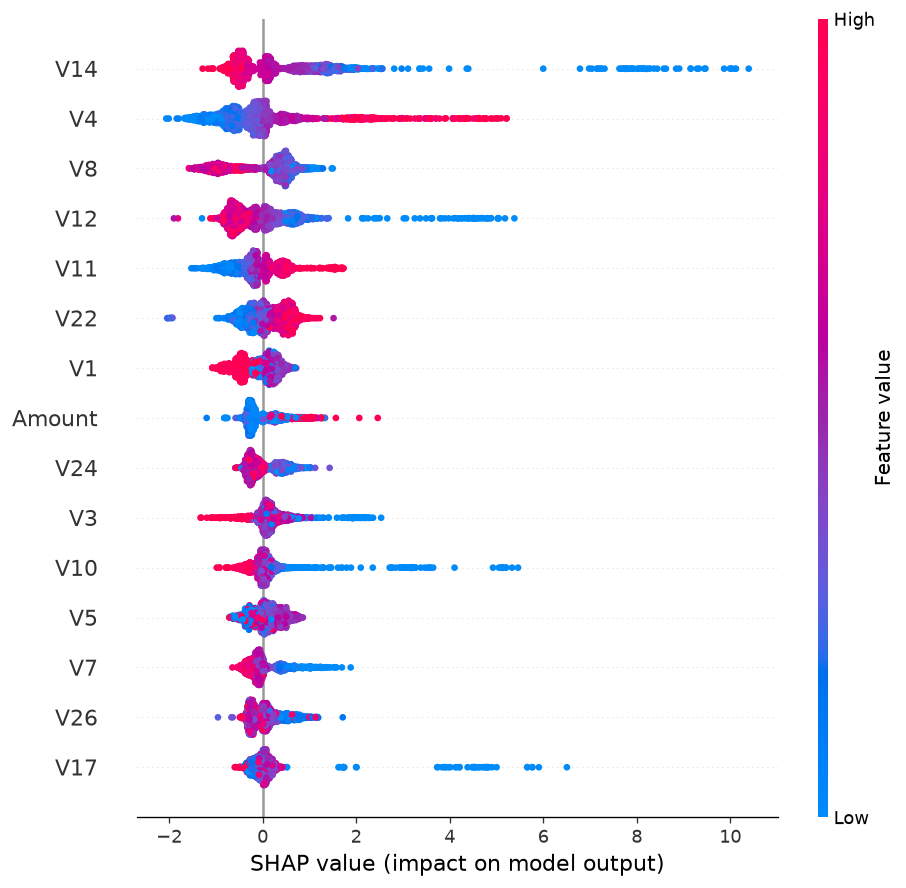

# Fraud Detection MLOps

[](https://github.com/dmatharv25-cmd/fraud-detection-mlops/actions/workflows/tests.yml)

The badge means the 4 unit tests pass (time-split order, PSI, cost arithmetic). They check code logic, not model quality.

Credit card fraud detection on the ULB dataset (284,807 transactions, 492 frauds, 0.17%), built with time-based splits and honest evaluation.

Status: core work done (baseline, LightGBM, cost thresholds, SHAP, API, Docker, drift monitoring, rolling evaluation, calibration check, missed-fraud analysis, load test).

## Summary

- **Problem:** flag fraud among 284,807 credit card transactions (492 frauds, 0.17%) from the ULB dataset. Splits follow time order, so every model is tested on later transactions than it was trained on.
- **Main result:** LightGBM scored 0.811 PR-AUC on the held-out test split against 0.744 for Logistic Regression. The interval for that difference barely excludes zero (+0.006 to +0.135), and in a rolling evaluation the average lead shrank to about 0.008 (LightGBM ahead in 3 of 4 blocks). I treat the two models as close.
- **Main limit:** at the 0.11 cutoff, 33 of 132 validation and test frauds (25%) were missed. They look close to normal on V14, V12 and V17, the features the model relies on most.
- **Also in this repo:** cost-based threshold, SHAP explanations, a FastAPI service with Docker, PSI and KS drift monitoring, a retraining trigger, and a calibration check.
- **Scope:** the data covers only about 48 hours, so nothing here is evidence of long-term drift. Costs are assumptions, not real bank data.

## Run it yourself

1. Get the data. Download the "Credit Card Fraud Detection" dataset (ULB Machine Learning Group, on Kaggle) and save the file as `data/creditcard.csv`. The `data/` folder is not in Git.
2. Create a virtual environment and install packages, one line at a time: `python -m venv .venv`, then `.venv\Scripts\activate`, then `pip install -r requirements.txt`.
3. Run the tests: `python -m pytest -q`
4. Run the analyses from the repo root, one at a time:
   - `python -W ignore -m src.final_eval`
   - `python -W ignore -m src.rolling_eval`
   - `python -W ignore -m src.calibration`
   - `python -W ignore -m src.missed_frauds`

- `requirements.txt` is a full `pip freeze` from a Windows machine. It pins every version, but it includes Windows-only packages (`pywin32`, `pywinpty`), so installing it on Linux or macOS will fail until those lines are removed. `requirements-api.txt` and `requirements-ci.txt` are smaller sets for the API container and CI.
- I have not tested a fresh clone on another machine.

## Data split

- Train: first 60% of time (360 frauds)
- Validation: next 20% (57 frauds), used for all tuning
- Test: last 20% (75 frauds), evaluated once at the end

## Results

| Model | Validation PR-AUC | Test PR-AUC | Test 95% bootstrap interval |
|---|---|---|---|
| Logistic Regression (balanced) | 0.7725 | 0.7438 | 0.626 to 0.849 |
| LightGBM (32 leaves, lr 0.02, 1564 trees) | 0.7882 | 0.8106 | 0.719 to 0.881 |

LightGBM minus Logistic Regression on test: +0.061, 95% interval +0.006 to +0.135.

## Findings and caveats

- Accuracy is useless here (always predicting "not fraud" gives 99.8%), so PR-AUC is the metric.
- LightGBM scored higher on test and the difference interval excludes zero, but the lower end is only +0.006, so the evidence is modest. On validation the two models were nearly tied.
- Only 75 test frauds, so all scores are noisy. The bootstrap captures this noise but not drift in fraud patterns over time.
- Class weighting (scale_pos_weight) hurt LightGBM badly in my experiments. I did not establish why.
- The test set was used once. Models were tuned only on validation.

## Cost-sensitive threshold results

Costs are assumptions, not real bank data. A false alarm costs 5, and a missed fraud costs the value in the first column. Thresholds were chosen on validation only, then applied once to the test set.

| Missed-fraud cost | LogReg test cost | LightGBM test cost | Flag nothing |
|---|---|---|---|
| 10 | 435 | 230 | 750 |
| 50 | 1075 | 985 | 3750 |
| 100 | 1745 | 1935 | 7500 |
| 500 | 6680 | 9535 | 37500 |

- Both models beat flagging nothing at every cost ratio.
- The lower-cost model flipped between a missed-fraud cost of 50 and 100 (LightGBM lower at 10 and 50, Logistic Regression lower at 100 and 500).
- The flip is not established. The gaps come from a handful of transactions, thresholds were picked on only 57 validation frauds, and I did not compute bootstrap intervals for these costs.
- Logistic Regression's best threshold hit the edge of my search grid (0.99) at low costs, so the true best cutoff may be higher.

## Explainability (SHAP)

SHAP values were computed for the final LightGBM on a test-set sample: all 75 frauds plus 2,000 random normal transactions. Values are in log-odds units, where positive pushes the score toward fraud.



| Rank | Feature | Mean abs SHAP |
|---|---|---|
| 1 | V14 | 0.860 |
| 2 | V4 | 0.677 |
| 3 | V8 | 0.578 |
| 4 | V12 | 0.531 |
| 5 | V11 | 0.398 |

- The highest-scored fraud (score 1.000) had several extreme feature values agreeing, led by V14 (+7.3), V12, V17, V4 and V10.
- The lowest-scored fraud (score 0.000, missed) had no strong signal on the features the model relies on. Its largest contribution was only +1.2 from V14, and some features pushed the other way.
- V1 to V28 are anonymized PCA components, so SHAP shows which components drive the model but not what they mean in real life.
- The sample is fraud-enriched, so the ranking reflects what drives fraud calls, not importance across normal traffic.
- I looked at only two individual transactions here. The Missed frauds section below compares caught and missed frauds in aggregate.

## Prediction API (FastAPI)

The final LightGBM is served with FastAPI. The cutoff (0.11) was chosen on validation using assumed costs of 100 per missed fraud and 5 per false alarm.

Run it:

```
python -m src.save_model
python -m uvicorn src.api:app --port 8000
```

- `GET /health` returns the status, the number of features and the threshold.
- `POST /predict` takes 29 numeric fields (V1 to V28 and Amount) and returns the fraud score, a flagged true/false, the threshold and the in-server scoring time. Missing or non-numeric fields get a 422 error.

Benchmark on 200 test-set transactions (10 frauds, 190 normal), sent one at a time:

| Metric | Value |
|---|---|
| Median latency | 6.8 ms |
| p95 latency | 8.6 ms |
| p99 latency | 9.2 ms |
| Max difference, API score vs direct score | 0 |

- Latency was measured from the client, including the HTTP round trip, with client and server on the same laptop and one request at a time. This is not a load test.
- The benchmark flagged 9 of 200 transactions, but it did not compare flags to labels, so that number is not a detection rate. For detection quality, use the cost-threshold section above.
- The model file is not in Git. Run `python -m src.save_model` to create it.

## Drift monitoring

Drift is measured with PSI (Population Stability Index) and the KS test, written with numpy and scipy. The reference period is the training split. The commonly used PSI cutoffs (0.1 and 0.25) are conventions, not laws.

| Period | Fraud rate | Mean model score | Flagged at 0.11 |
|---|---|---|---|
| Train | 0.211% | 0.00211 | 0.211% |
| Validation | 0.100% | 0.00078 | 0.084% |
| Test | 0.132% | 0.00107 | 0.111% |

- Against the training period, 8 of 29 features have PSI above 0.25 in validation and 7 of 29 in test.
- V1, V3, V28, V11 and V25 lead both comparisons. V1 and V3 are above 1.0 in both. PSI and KS agree on these features.
- The mean score and flag rate fall and rise together with the fraud rate. When labels arrive late, this is the early signal available in production.

Does the drift hurt the model? The test period was split into two halves by time and scored with the same saved model:

| | First half | Second half |
|---|---|---|
| Frauds | 53 | 22 |
| PR-AUC | 0.848 (95% interval 0.748 to 0.934) | 0.730 (95% interval 0.545 to 0.888) |
| Frauds caught at 0.11 | 40 of 53 (75%) | 16 of 22 (73%) |
| False alarms | 1 | 6 |

- Drift alerts fired, but the catch rate stayed about the same. An alert means look closer, not the model is broken.
- The PR-AUC intervals overlap, and I did not test the difference directly, so I cannot call the drop a real decline. Part of it may come from the fall in fraud volume, but I did not separate that from model decay.
- The data covers only about 48 hours. This demonstrates the monitoring method. It is not evidence of long-term drift, and some of the shift may be time-of-day effects.

## Retraining trigger

`python -m src.retrain_trigger` decides whether to retrain. It retrains only when both conditions fire:

- Drift: more than 5 of 29 features have PSI above 0.25 against the training period.
- Performance: the share of frauds caught at the 0.11 cutoff falls by more than 10 percentage points compared with validation.

Result on this data, with the test period as the new window:

| Check | Value | Fired |
|---|---|---|
| Drifted features | 7 of 29 | Yes |
| Catch rate, validation vs new window | 75.4% vs 74.7% | No |

- Decision: do not retrain. Drift alone is not enough, because earlier the drift alerts fired while the catch rate barely moved.
- The limits (PSI 0.25, more than 5 features, a 10 point drop) are my choices, not standards.
- The catch-rate comparison rests on 57 validation frauds and 75 test frauds, so a 10 point margin is a loose guard.
- `--force` trains a candidate on all data and saves it to `models/candidate.pkl`. It never overwrites the current model. The candidate cannot be evaluated here because no unseen data is left. Promoting it would need a fresh later time window.

## Docker

The prediction API can run in a container. The model file is not in Git, so create it first, then build and run:

```
python -m src.save_model
docker build -t fraud-api .
docker run --rm -p 8000:8000 fraud-api
```

The same benchmark (200 test-set transactions, one request at a time) was run against the local server and against the container:

| | Local server | Docker container |
|---|---|---|
| Median latency | 6.8 ms | 10.2 ms |
| p95 latency | 8.6 ms | 11.7 ms |
| p99 latency | 9.2 ms | 13.0 ms |
| Max score difference vs direct scoring | 0 | 2.6e-26 |

- Scores match to floating-point rounding. I did not verify the cause of the tiny difference.
- The container is about 3.5 ms slower at the median. I did not measure where the extra time goes.
- The model is copied in from the local `models/` folder at build time, so the image only works with that exact model. A real system would load it from a registry or storage at startup.
- The image also contains `candidate.pkl`, which the API never loads.
- Latency is one request at a time on one laptop. This is not a load test.

## Rolling-window evaluation

The single test split has only 75 frauds, so I also ran a rolling evaluation (`python -W ignore -m src.rolling_eval`). The data is cut into 6-hour blocks. For each block from hour 24 onward, both models are trained on all earlier blocks and scored on that block. Blocks with fewer than 5 frauds would be skipped (none were).

| Test block (hours) | Train frauds | Test frauds | LogReg PR-AUC | LightGBM PR-AUC |
|---|---|---|---|---|
| 24-30 | 281 | 69 | 0.8836 | 0.8884 |
| 30-36 | 350 | 27 | 0.7332 | 0.7005 |
| 36-42 | 377 | 63 | 0.8089 | 0.8418 |
| 42-48 | 440 | 52 | 0.7248 | 0.7520 |
| Mean | | | 0.7876 | 0.7957 |

- LightGBM was higher in 3 of 4 blocks. Its mean lead is about 0.008, much smaller than the 0.067 lead on the single test split (0.811 vs 0.744).
- The one block LightGBM lost (30-36) has the fewest test frauds (27), so it is the noisiest. The 24-30 block is close to a tie.
- Scores for both models swing from about 0.70 to 0.89 depending on the block. That spread is larger than the gap between the models, so a single test window can make either model look much better or worse.
- I did not compute an interval for the 0.008 gap. With 4 blocks, and later training sets containing earlier blocks (so the blocks are not independent), the data cannot clearly separate the models.
- LightGBM used 600 trees here instead of the 1564 in the final model, to keep runs fast. I did not test whether 600 is a good number, so these are not exactly the final model's scores.
- Settings were otherwise fixed from earlier and nothing was tuned per block.
- The data covers only about 48 hours, so block differences may also reflect time-of-day effects.

## Calibration check

`python -W ignore -m src.calibration` trains the final LightGBM on the training split and compares its scores with actual fraud rates on validation and test. It only measures. It changes no model and no saved file.

| | Validation | Test |
|---|---|---|
| Frauds | 57 | 75 |
| Brier score, model | 0.000292 | 0.000433 |
| Brier score, constant base rate | 0.001000 | 0.001315 |
| Log loss | 0.00335 | 0.00441 |

Top score bin (0.9 to 1.0):

| | Rows | Frauds | Mean score | Actual fraud rate |
|---|---|---|---|---|
| Validation | 40 | 39 | 0.996 | 97.5% |
| Test | 57 | 54 | 0.994 | 94.7% |

- The model's Brier score is about 3 times lower than predicting the base rate for every transaction, so the scores carry information.
- The top bin is close to calibrated. On test it is slightly overconfident (0.994 vs 94.7%), but with 57 rows, 3 missed frauds move the rate by about 5 points.
- The lowest bin (scores below 0.001) holds about 56,900 rows per split, with 14 frauds on validation and 18 on test. These are frauds the model scores near zero. That is a recall limit, not a calibration finding.
- The middle bins hold only 1 to 7 rows each (for example, test scores of 0.5 to 0.9: 5 rows, 1 fraud). I cannot judge calibration there, and I did not test whether recalibration (Platt or isotonic) would help.
- The bin edges were my choice.
- Fraud rates here (0.10% to 0.13%) are specific to this dataset. In traffic with a different fraud rate, a score of 0.9 would not mean the same thing.

## Missed frauds

`python -W ignore -m src.missed_frauds` trains the final LightGBM on the training split, pools the validation and test frauds (132 in total), and compares the frauds caught at the 0.11 cutoff with the missed ones. It only measures. It changes no model and no saved file.

| | Frauds | Caught | Missed |
|---|---|---|---|
| Validation | 57 | 43 | 14 |
| Test | 75 | 56 | 19 |
| Pooled | 132 | 99 | 33 |

Features where missed and caught frauds differ most (difference in means, in units of the standard deviation of normal training transactions):

| Feature | Caught mean | Missed mean | Difference |
|---|---|---|---|
| V14 | -7.60 | -1.76 | 6.51 |
| V17 | -3.74 | 0.90 | 6.10 |
| V12 | -4.68 | -0.30 | 4.08 |
| V16 | -2.76 | 0.42 | 3.81 |
| V10 | -4.07 | -0.24 | 3.73 |

- The missed frauds look close to normal on the features the model relies on most. V14 and V12 also lead the SHAP ranking, so the model's strongest signals are quiet on these frauds.
- Amount does not clearly separate the groups. The medians are close (6.74 caught, 8.00 missed). The mean is higher for missed frauds (215.57 vs 129.76), but a few large amounts can drive that with only 33 rows.
- This is partly circular. A fraud counts as missed because the model scored it low, and the model scores low when these features are unremarkable. It shows why they are missed, not that a better model could find them.
- I did not test whether the differences are statistically solid, and I did not check whether the missed frauds form one group or several kinds. The lowest-scored examples are mixed: some have a high V4, others look ordinary everywhere I looked.
- The cutoff (0.11) was chosen on validation, so the validation misses are not fully unseen for that choice.
- V1 to V28 are anonymized, so I cannot say what these fraud types are in real life.

## Load test

`python -W ignore -m src.load_test` sends 400 requests per level to `POST /predict` from 1, 4, 16 and 32 concurrent clients. The payloads are the same 10 frauds and 190 normal test transactions as the one-at-a-time benchmark. The server was one uvicorn process, started with `python -m uvicorn src.api:app --port 8000`.

| Clients | Requests/s | p50 (ms) | p95 (ms) | p99 (ms) | Errors |
|---|---|---|---|---|---|
| 1 | 128.3 | 7.6 | 9.2 | 10.0 | 0 |
| 4 | 138.4 | 25.2 | 29.4 | 35.9 | 0 |
| 16 | 157.5 | 101.0 | 110.5 | 139.9 | 0 |
| 32 | 155.1 | 201.5 | 231.0 | 362.9 | 0 |

- Throughput levels off at about 130 to 160 requests per second. Beyond 4 clients, extra clients mostly wait longer: median latency roughly doubles each time the client count doubles.
- No request failed at any level.
- The 1-client median (7.6 ms) is consistent with the earlier one-at-a-time benchmark (6.8 ms).
- I did not find out why throughput levels off. The Python client shares the laptop's CPU with the server, and each request builds a pandas DataFrame, but I tested neither.
- This is one run, one server process, one machine and a fixed request mix, not production traffic. Numbers will vary between runs, so treat them as rough. The Docker container was not load tested.

## Next

- A fresh-window evaluation of the retrained candidate is blocked. The data covers only about 48 hours and no unseen later period is left, so it needs new data.
- The missed-fraud differences have no significance test, and I did not check whether the missed frauds form one group or several.
- The load test shows throughput levelling off, but I did not find the cause or test the Docker container under load.

## Live demo

The model is deployed as a FastAPI service on Render (free tier):

- Service: https://fraud-detection-mlops-1l61.onrender.com
- Health check: https://fraud-detection-mlops-1l61.onrender.com/health
- Interactive docs (try `POST /predict`): https://fraud-detection-mlops-1l61.onrender.com/docs

**Cold start:** the free service sleeps after inactivity, so the first request can take up to a minute while it wakes up.

**Smoke test on the live service:** 10 test-set transactions (5 fraud, 5 normal) were sent to `/predict`. All returned HTTP 200. The 5 frauds scored 0.9989 to 1.0 and were flagged; the 5 normal transactions scored 0.0 and were not flagged. This confirms the deployed model loads and applies the 0.11 threshold. It is not an accuracy estimate: see the evaluation section for recall and precision, including the roughly one quarter of frauds missed at this threshold.

**Performance note:** the load-test and latency numbers in this README were measured on a local laptop. The Render free tier has a fraction of a CPU and 512 MB of RAM, so latency there will be higher.

## Example request

Score one transaction from the command line:

```bash
curl -X POST https://fraud-detection-mlops-1l61.onrender.com/predict \
  -H 'Content-Type: application/json' \
  -d '{"V1": 1.914, "V2": -0.4901, "V3": -0.3261, "V4": 0.6047, "V5": -0.8501, "V6": -0.7363, "V7": -0.5241, "V8": -0.0886, "V9": 1.0911, "V10": 0.0935, "V11": -0.8923, "V12": 0.0272, "V13": -0.2438, "V14": 0.0318, "V15": 0.9006, "V16": 0.536, "V17": -0.6484, "V18": 0.1831, "V19": -0.4863, "V20": -0.1396, "V21": 0.211, "V22": 0.6393, "V23": 0.1475, "V24": 0.0737, "V25": -0.3184, "V26": 0.3506, "V27": -0.0238, "V28": -0.0371, "Amount": 50.0}'
```

Response:

```json
{"fraud_score": 0.0000, "flagged": false, "threshold": 0.11, "latency_ms": 51.69}
```
